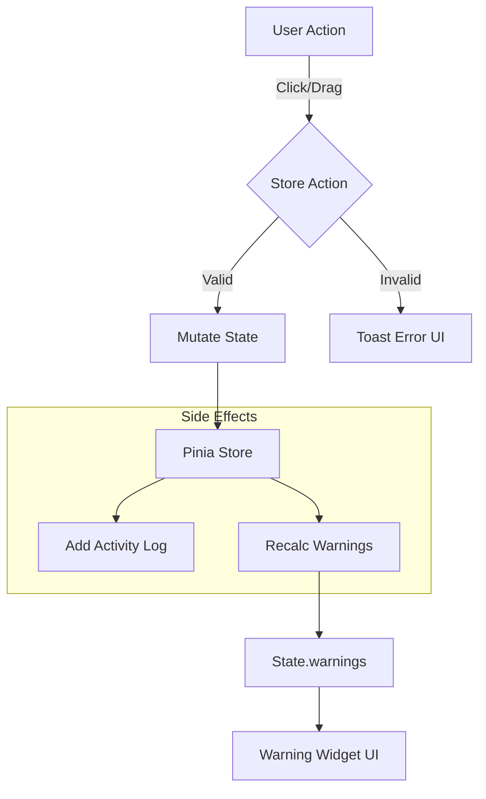

# Assignment Alert & Notification System Architecture

## 1. Overview
The assignment alert system is designed to provide a multi-layered feedback loop for user actions. It separates concerns between **immediate interaction feedback** (Toasts), **persistent state monitoring** (Warning Widget), and **audit logging** (Activity Feed).

## 2. Visual Hierarchy & Design System

We utilize a consistent severity-based visual language across all notification components (`WarningWidget`, `Toast`, `badges`).

### Severity Levels (`Warning['level']`)

| Level | Semantic Meaning | Tailwind Theme (Light/Dark) | Icon (Heroicons) |
| :--- | :--- | :--- | :--- |
| **Error** | **Blocker / Rule Violation** | `bg-red-500/10` + `text-red-500` | `exclamation-circle` |
| **Warn** | **Potential Issue** | `bg-amber-500/10` + `text-amber-500` | `exclamation-triangle` |
| **Info** | **Suggestion / Note** | `bg-blue-500/10` + `text-blue-500` | `information-circle` |

### Configuration implementation (`WarningWidget.vue`)

```typescript
const levelConfig: Record<WarningLevel, LevelConfig> = {
  error: {
    icon: ExclamationCircleIcon,
    bgClass: 'bg-destructive/15 text-destructive',
    borderClass: 'border-destructive/50'
  },
  warn: {
    icon: ExclamationTriangleIcon,
    bgClass: 'bg-amber-500/15 text-amber-500',
    borderClass: 'border-amber-500/50'
  }
  // ...info
}
```

---

## 3. Architecture & Data Flow

The system follows a uni-directional data flow using **Pinia** for state management. 

### Data Flow Diagram



---

## 4. Key Components & Logic

### A. Pre-Assignment Validation (`assignment.ts`)

In the Store actions, we perform basic validation before mutating state.

### B. Persistent State Monitoring (`assignment.ts`)

The store triggers a warning recalculation (`recalcWarnings`) whenever the assignment draft or week date changes. This ensures the Warning Widget is always eventually consistent with the board state.

```typescript
// Pinia Store
export const useAssignmentStore = defineStore('assignment', () => {
    // ... actions
    
    function assignRole(part, role, value) {
        // 1. Mutate State
        setSlotValue(currentDraft.value, { part, role }, value)
        
        // 2. Add Audit Log
        activityStore.addActivity({ type: 'assignment', ... })
        
        // 3. Trigger Rule Engine
        recalcWarnings() 
    }

    function recalcWarnings() {
        warnings.value = computeWarnings(currentWeekDate.value, currentDraft.value, app.value)
    }
})
```

### C. The Warning Widget (`WarningWidget.vue`)

A unified view for all persistent alerts. It uses a **Filter Design** to view specific types of issues.

*   **Error/Warn**: Critical blocking issues.
*   **Info**: helpful suggestions (Rotation candidates).

---

## 5. UI/UX Interactions

### Toast Triggers (Ephemeral)
*   **Blocker**: "Member already assigned to Part 1" (Error Toast)
*   Uses `vue-sonner` for toast notifications.

### Activity Feed (Historical)
*   Visualizes the `draftHistory` stack.
*   Uses `@vueuse/motion` for smooth layout transitions when items are added.
*   Includes `Undo` capability directly from the feed header.

## 6. Development Notes

*   **Extensibility**: To add new rules, modify `computeWarnings` in `shared/utils/rules.ts`. The UI will automatically render the new rule based on its severity level.
*   **Type Safety**: All slot descriptors and role keys are strictly typed to prevent "stringly typed" errors in the validation logic.
