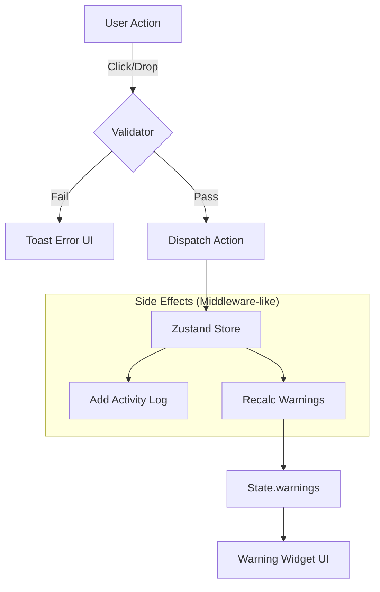

# Assignment Alert & Notification System Architecture

## 1. Overview
The assignment alert system is designed to provide a multi-layered feedback loop for user actions. It separates concerns between **immediate interaction feedback** (Toasts), **persistent state monitoring** (Warning Widget), and **audit logging** (Activity Feed).

## 2. Visual Hierarchy & Design System

We utilize a consistent severity-based visual language across all notification components (`WarningWidget`, `Toast`, `badges`).

### Severity Levels (`Warning['level']`)

| Level | Semantic Meaning | Tailwind Theme (Light/Dark) | Icon (Material Symbols) |
| :--- | :--- | :--- | :--- |
| **Error** | **Blocker / Rule Violation** | `bg-red-500/10` + `text-red-500` | `error` |
| **Warn** | **Potential Issue** | `bg-amber-500/10` + `text-amber-500` | `warning` |
| **Info** | **Suggestion / Note** | `bg-blue-500/10` + `text-blue-500` | `info` |

### Configuration implementation (`WarningWidget.tsx`)

```typescript
const levelConfig: Record<Warning['level'], LevelConfig> = {
  error: {
    icon: 'error',
    bgClass: 'bg-red-500/10 dark:bg-red-500/15',
    textClass: 'text-red-500'
  },
  warn: {
    icon: 'warning',
    bgClass: 'bg-amber-500/10 dark:bg-amber-500/15',
    textClass: 'text-amber-500'
  }
  // ...info
}
```

---

## 3. Architecture & Data Flow

The system follows a uni-directional data flow using **Zustand** for state management. 

### Data Flow Diagram



---

## 4. Key Components & Logic

### A. Pre-Assignment Validation (`slotValidation.ts`)

Before any state mutation, we validate the intent. We use a **Discriminated Union** return type for type-safe handling of validation failures.

```typescript
export type AssignmentValidation =
    | { canAssign: true }
    | { 
        canAssign: false; 
        reason: 'same_slot' | 'already_in_part'; 
        existingSlot?: SlotInfo 
      }

export function validateAssignment(draft, part, role, name): AssignmentValidation {
    // 1. Check if member exists in the target part (1st/2nd Service)
    const existing = findMemberSlotInPart(draft, part, name)
    
    if (!existing) return { canAssign: true }
    
    // 2. Check if it's the exact same slot (idempotent action)
    if (isSameSlot(existing, target)) {
        return { canAssign: false, reason: 'same_slot', existingSlot: existing }
    }
    
    // 3. Member is already in a DIFFERENT role in this part
    return { canAssign: false, reason: 'already_in_part', existingSlot: existing }
}
```

### B. Persistent State Monitoring (`assignmentSlice.ts`)

The store triggers a warning recalculation (`recalcWarnings`) whenever the assignment draft or week date changes. This ensures the Warning Widget is always eventually consistent with the board state.

```typescript
// Zustand Slice Pattern
export const createAssignmentSlice: StateCreator<...> = (set, get) => ({
    // ... actions
    
    assignRole: (part, role, value) => {
        // 1. Mutate State
        set(produce(state => {
            state.currentDraft[part][role] = value
        }))
        
        // 2. Add Audit Log
        get().addActivity({ type: 'assignment', ... })
        
        // 3. Trigger Rule Engine
        get().recalcWarnings() 
    },

    recalcWarnings: () => {
        const warnings = computeWarnings(get().currentWeekDate, get().currentDraft, get().app)
        set({ warnings })
    }
})
```

### C. The Warning Widget (`WarningWidget.tsx`)

A unified view for all persistent alerts. It uses a **Split-Tab Design** to separate critical blocking issues from helpful suggestions.

*   **Alerts Tab**: Filters for `level === 'error' | 'warn'`
*   **Info Tab**: Filters for `level === 'info'` (AI Suggestions, etc.)

---

## 5. UI/UX Interactions

### Toast Triggers (Ephemeral)
*   **Blocker**: "Member already assigned to Part 1" (Error Toast)
*   **Info**: "Member assignment cleared" (Info Toast)

### Activity Feed (Historical)
*   Visualizes the `draftHistory` stack.
*   Uses `framer-motion` for smooth layout transitions when items are added.
*   Includes `Undo` capability directly from the feed header.

## 6. Development Notes

*   **Extensibility**: To add new rules, modify `computeWarnings` in `shared/utils/rules.ts`. The UI will automatically render the new rule based on its severity level.
*   **Type Safety**: All slot descriptors and role keys are strictly typed to prevent "stringly typed" errors in the validation logic.
